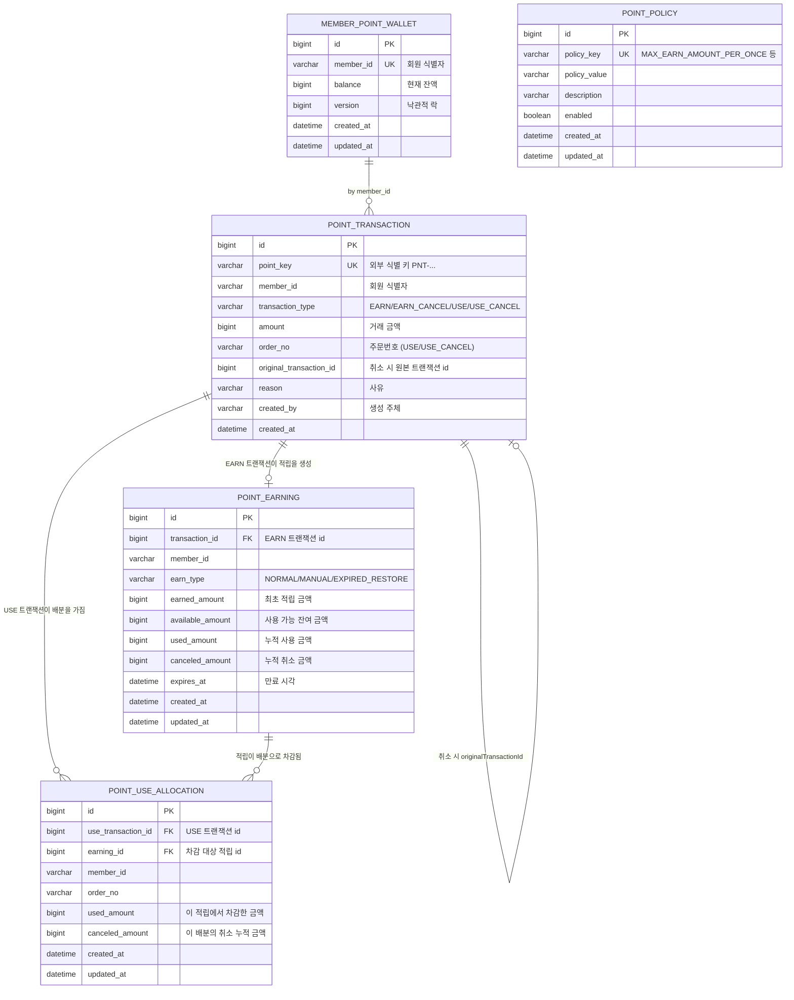
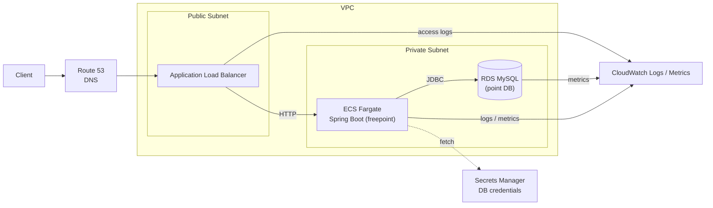

# 무료 포인트 시스템 (freepoint)

무신사 백엔드 채용 과제로 작성한 무료 포인트 시스템 API 입니다. 적립 / 적립취소 / 사용 / 사용취소를 단일 데이터베이스 트랜잭션으로 안전하게 처리하고, 적립 단위별 잔여/만료/사용 이력을 1원 단위까지 추적할 수 있도록 설계했습니다.

---

## 개발 환경

| 항목 | 버전 |
|---|---|
| Java | 21 (Toolchain) |
| Spring Boot | 3.3.5 |
| Build | Gradle (wrapper 8.10.2) |
| ORM | Spring Data JPA / Hibernate |
| DB (로컬) | H2 in-memory (MODE=MySQL) |
| Validation | jakarta.validation |
| Lombok | 사용 |

---

## 실행 방법

### 빌드 & 테스트

```bash
./gradlew clean build
```

### 애플리케이션 실행

```bash
./gradlew bootRun
```

기본 포트는 `8080` 입니다. 점유 시 `SERVER_PORT=18080 ./gradlew bootRun` 등으로 변경 가능합니다.

### H2 Console 접속

애플리케이션 실행 후 브라우저에서 접속:

```
http://localhost:8080/h2-console
```

| 항목 | 값 |
|---|---|
| JDBC URL | `jdbc:h2:mem:freepoint;MODE=MySQL;DB_CLOSE_DELAY=-1` |
| User Name | `sa` |
| Password | (비어 있음) |

---

## API 목록

모든 응답은 `ApiResponse<T>` 래퍼 형태입니다.

```json
{ "success": true,  "data": { ... } }
{ "success": false, "error": { "code": "E001", "message": "..." } }
```

### 1. 포인트 적립

`POST /api/v1/points/earn`

```json
{
  "memberId": "member-1",
  "amount": 1000,
  "earnType": "NORMAL",
  "expireDays": 365,
  "reason": "EVENT_REWARD"
}
```

- `earnType` 외부 노출 값: `NORMAL` / `MANUAL` (`EXPIRED_RESTORE`는 내부 전용)
- `expireDays` 누락 시 정책 기본값(365일) 적용

### 2. 포인트 적립취소

`POST /api/v1/points/earn/{pointKey}/cancel`

```json
{ "memberId": "member-1", "reason": "ADMIN_CANCEL" }
```

- 일부라도 사용된 적립은 취소 불가 (`EARNING_ALREADY_USED`)
- 이미 취소된 적립은 재취소 불가 (`EARNING_ALREADY_CANCELED`)

### 3. 포인트 사용

`POST /api/v1/points/use`

```json
{ "memberId": "member-1", "orderNo": "A1234", "amount": 1200 }
```

응답 `allocations`에서 어떤 적립 건에서 얼마가 차감되었는지 확인할 수 있습니다.

### 4. 포인트 사용취소

`POST /api/v1/points/use/{pointKey}/cancel`

```json
{ "memberId": "member-1", "amount": 1100, "reason": "ORDER_CANCEL" }
```

- 전체/부분 취소 모두 지원
- 응답 `restoredAllocations[].restoreType`이 `ORIGINAL_EARNING` / `NEW_EARNING` 중 하나로 표기

### 5. 잔액 조회

`GET /api/v1/points/members/{memberId}/balance`

### 6. 적립 내역 조회

`GET /api/v1/points/members/{memberId}/earnings`

각 항목은 `(earningId, pointKey, earnType, earnedAmount, availableAmount, usedAmount, canceledAmount, expiresAt)`을 포함합니다.

### 7. 거래 내역 조회

`GET /api/v1/points/members/{memberId}/transactions`

`EARN / EARN_CANCEL / USE / USE_CANCEL` 트랜잭션이 시간순으로 반환됩니다.

---

## 주요 설계 설명

### 5개 핵심 테이블 역할 분리

- **`member_point_wallet`** — 회원당 1행. 빠른 잔액 조회와 동시성 제어 단위.
- **`point_transaction`** — 모든 포인트 변동 이벤트의 원장(append-only). EARN / EARN_CANCEL / USE / USE_CANCEL 4종. 취소 트랜잭션은 `original_transaction_id`로 원본을 가리킵니다.
- **`point_earning`** — 적립 단위(EARN 트랜잭션 1건당 1행). `available_amount / used_amount / canceled_amount / expires_at`를 통해 적립별 잔여와 만료를 독립적으로 관리합니다.
- **`point_use_allocation`** — 사용 시 어떤 적립에서 얼마를 차감했는지 1원 단위로 기록. 사용취소 시 역순 복원의 근거가 됩니다.
- **`point_policy`** — 1회 최대 적립, 보유 한도, 기본/최소/최대 만료일을 key-value 정책으로 분리. 부팅 시 `DataInitializer`가 멱등적으로 시드합니다.

### 사용 우선순위

`PointEarningRepository.findUsableEarnings`가 다음 순서로 정렬해 차감 후보를 반환합니다.

1. `MANUAL` (관리자 수기 적립) 우선
2. 같은 타입 내에서 `expires_at` 빠른 순 (선입선출)
3. `id` 빠른 순 (동률 안정 정렬)

### 사용취소 정책

`cancelUse`는 원본 USE의 `point_use_allocation`들을 id 오름차순(=차감 시점 순서)으로 순회하며 다음을 적용합니다.

- **원 적립이 만료되지 않은 경우** → `ORIGINAL_EARNING`
  - `PointEarning.restore(amount)` 호출로 `available_amount` 복원, `used_amount` 차감
  - `allocation.canceled_amount`만 증가
- **원 적립이 이미 만료된 경우** → `NEW_EARNING`
  - 새 EARN 트랜잭션 + `earnType=EXPIRED_RESTORE` 신규 적립 생성 (`expires_at = now + DEFAULT_EXPIRE_DAYS`)
  - 원 적립은 그대로 두고 `allocation.canceled_amount`만 증가
- 마지막으로 `USE_CANCEL` 트랜잭션을 1건 생성하고 `wallet.balance += amount`

응답에서 각 배분이 어느 경로로 복원되었는지(`restoreType`)와 새로 만든 적립의 `pointKey`(`newEarningPointKey`)가 그대로 노출됩니다.

### 동시성 제어

회원당 모든 포인트 변경(적립/취소/사용/사용취소)은 시작 시 `MemberPointWalletRepository.findByMemberIdForUpdate`로 `SELECT ... FOR UPDATE`(PESSIMISTIC_WRITE) 락을 잡아 직렬화합니다. 동일 회원에 대한 동시 호출은 `wallet` row 단위로 줄을 서고, 서로 다른 회원은 병렬로 진행됩니다. 또한 `MemberPointWallet`은 `@Version`을 가져 외부 경합이 발생하면 OptimisticLockException으로 안전하게 실패합니다.

### 외부 식별자 (pointKey)

모든 트랜잭션은 `PNT-{yyyyMMddHHmmss}-{8자 영문/숫자}` 형태의 `pointKey`(unique)를 가지며, 외부 API는 항상 이 키를 통해서 거래를 지칭합니다. 내부 PK 노출을 막고 멱등 키로 활용 가능합니다.

---

## ERD

원본 파일: [`src/main/resources/erd/point-erd.mmd`](src/main/resources/erd/point-erd.mmd)



> 도메인 단순화를 위해 외래키 제약은 두지 않고 ID 참조로만 연결했습니다. 위 다이어그램의 FK 표기는 논리적 관계입니다.

---

## AWS 배포 아키텍처 (참고)

원본 파일: [`src/main/resources/architecture/aws-architecture.mmd`](src/main/resources/architecture/aws-architecture.mmd)



- **ALB**: Public Subnet에 배치되어 외부 트래픽을 받고 ECS Task로 분산
- **ECS Fargate**: Private Subnet의 freepoint 컨테이너. RDS 자격증명은 Secrets Manager에서 런타임에 조회
- **RDS MySQL**: Multi-AZ 권장. H2와의 호환성을 위해 H2 데이터소스에서 `MODE=MySQL`로 설정
- **CloudWatch**: 애플리케이션 로그, ALB 액세스 로그, RDS 메트릭 통합 수집

---

## 테스트 실행 방법

```bash
./gradlew test
```

테스트는 모두 서비스 레이어 중심으로 작성되어 있고, 시간 의존 케이스는 `TestTimeProvider` Fake로 결정적으로 재현합니다.

### 주요 테스트 시나리오 (총 26건)

`PointCommandServiceTest` (21건)

- **적립 성공**: wallet/transaction/earning 동시 생성, 기본 만료일 365일 적용
- **적립 실패**: amount=0, 1회 한도 초과, 보유 한도 초과, expireDays 0/1825
- **MANUAL 적립**: earnType이 그대로 보존
- **적립취소 성공**: 잔액 복귀, EARN_CANCEL 생성, earning canceledAmount 증가
- **적립취소 실패**: 일부 사용된 적립, 이미 취소된 적립
- **사용 성공**: USE + Allocation + earning 추적 일관성
- **사용 우선순위**: MANUAL이 NORMAL보다 우선, 같은 타입은 만료 짧은 순
- **사용 실패**: orderNo blank, 잔액 부족, 모두 만료된 적립만 있는 경우
- **사용취소 성공(미만료)**: ORIGINAL_EARNING 복원, allocation.canceledAmount 증가
- **사용취소 성공(만료)**: 시간 이동 후 EXPIRED_RESTORE 신규 적립 생성, expiresAt 정확
- **사용취소 실패**: 취소 가능 금액 초과, USE 외 트랜잭션

`PointQueryServiceTest` (5건)

- 적립/사용 후 balance 정확성
- 미존재 회원의 balance=0
- earnings의 pointKey/타입/used/available 검증
- transactions의 EARN→USE→USE_CANCEL 순서, originalTransactionId 매핑
- 미존재 회원의 earnings/transactions 빈 배열

---

## 패키지 구조

```
com.musinsa.freepoint
├── FreepointApplication.java         # @SpringBootApplication, @EnableJpaAuditing
├── application/                      # 서비스 레이어
│   ├── PointCommandService           # 적립/취소/사용/사용취소
│   ├── PointQueryService             # 조회
│   ├── PointPolicyService            # 정책 조회
│   ├── PointKeyGenerator             # pointKey 발급
│   └── RestoreType                   # ORIGINAL_EARNING / NEW_EARNING
├── domain/                           # JPA 엔티티 + 리포지토리
│   ├── common/BaseTimeEntity         # createdAt, updatedAt
│   ├── wallet/                       # MemberPointWallet
│   ├── transaction/                  # PointTransaction, PointTransactionType
│   ├── earning/                      # PointEarning, PointEarnType
│   ├── usage/                        # PointUseAllocation
│   └── policy/                       # PointPolicy, PointPolicyKey
├── presentation/                     # 컨트롤러 + DTO
│   ├── PointController
│   ├── request/                      # 요청 DTO + 검증
│   └── response/                     # 응답 DTO
├── common/                           # 공용 인프라
│   ├── exception/                    # BusinessException, ErrorCode, GlobalExceptionHandler
│   ├── response/ApiResponse
│   └── time/                         # TimeProvider, SystemTimeProvider
└── config/
    └── DataInitializer               # 정책 시드
```
